# 🤖 Rust-eze — WRO 2026 Future Engineers


Official repository of team **Rust-eze** for the WRO 2026 Future Engineers category. Here you will find the source code of our robot, technical documentation, hardware schematics, and multimedia material from our autonomous robot.

---


## 📑 Table of contents

- [Team](#-Team)
- [Vehicle Photos](#-Vehicle-Photos)
- [Mechanical Design Process](#-Mechanical-Design-Process)
- [Electrical System](#-Electrical-System)
- [Wiring Diagram](#-Wiring-Diagram)
- [Components](#-Components)
- [Source Code](#-Source-Code)
- [Build & Setup](#-Build-&-Setup)
- [Team Photos](#-Team-Photos)


---

## 👥 Team

| Name | Role |
|------|------|
| Emi | Mechanical |
| Oliver | Electronics |
| Paco | Programmer |
| Leo | Coach |

---

## 📷 Vehicle Photos

| Front | Front-2 | Right |
|:---:|:---:|:---:|
| 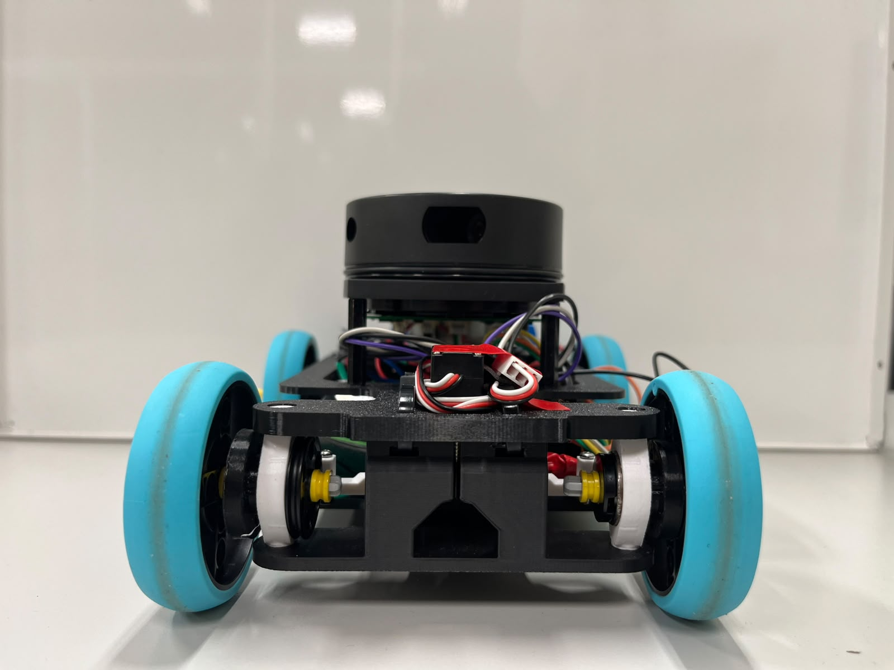 | 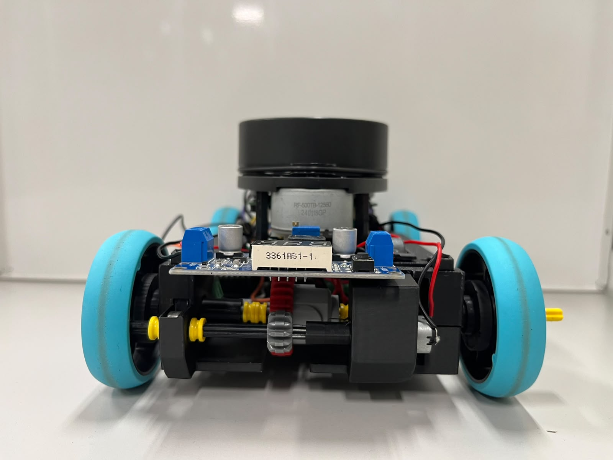 | 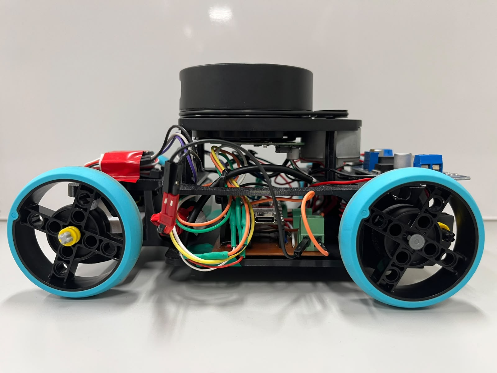 |
| **Right-2** | **Top** | **Isometric** |
| 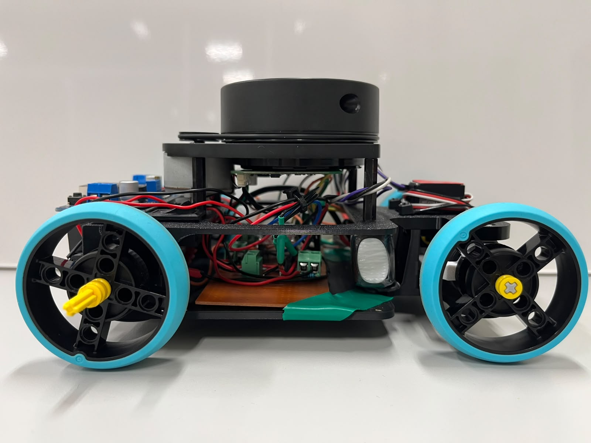 | 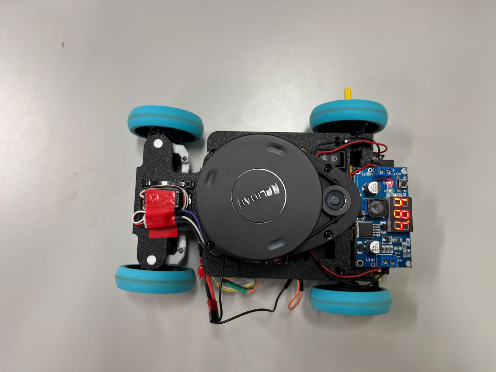 | 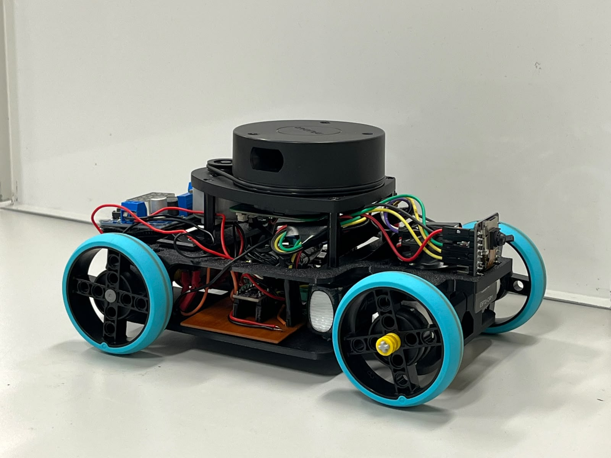 |

---

## ⚙️ Mechanical Design Process

Our mechanical design focuses on stability, , and precise maneuverability to tackle the high-speed requirements of the WRO Future Engineers challenges. The entire robot was designed from scratch using CAD software and manufactured via 3D printing.

### 1. Chassis & Weight Distribution
* **Material:** Printed in PLA/PETG for a great balance between rigidity and lightweight performance.
* **Low Center of Gravity:** Heavier components, such as the LiPo battery and the Pololu motor, are mounted as low as possible to prevent the robot from tipping over during sharp corners.
* **Modular Design:** The chassis is divided into easily replaceable sections (front steering assembly, main body, and rear drivetrain) to allow quick repairs during competition days. Also, our CAD desing is basically 2 pieces that consist of a top_cover and main_chassis with each mechanisism working independently.

| Top | Chassis |
|:---:|:---:|
| <div align="center">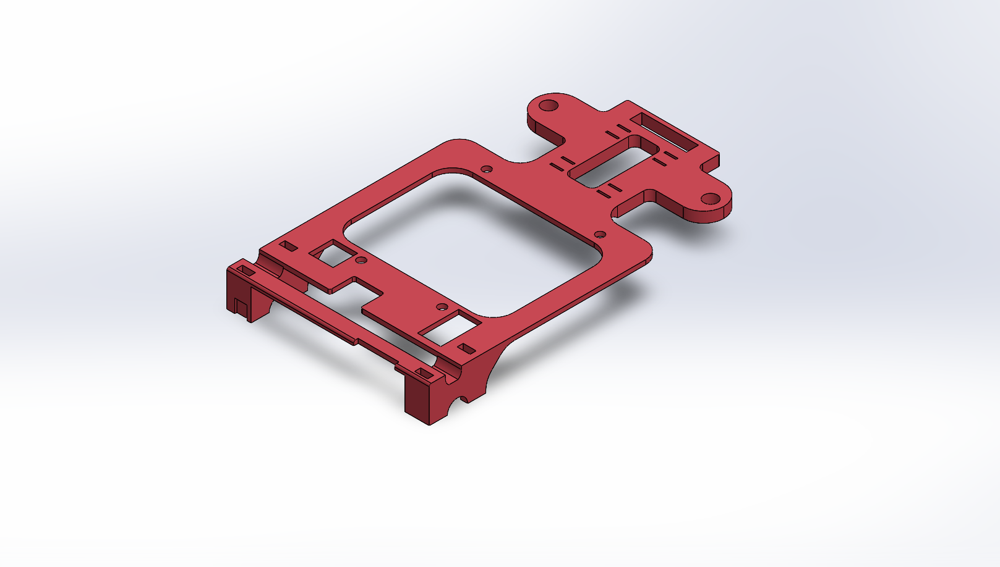</div> | <div align="center">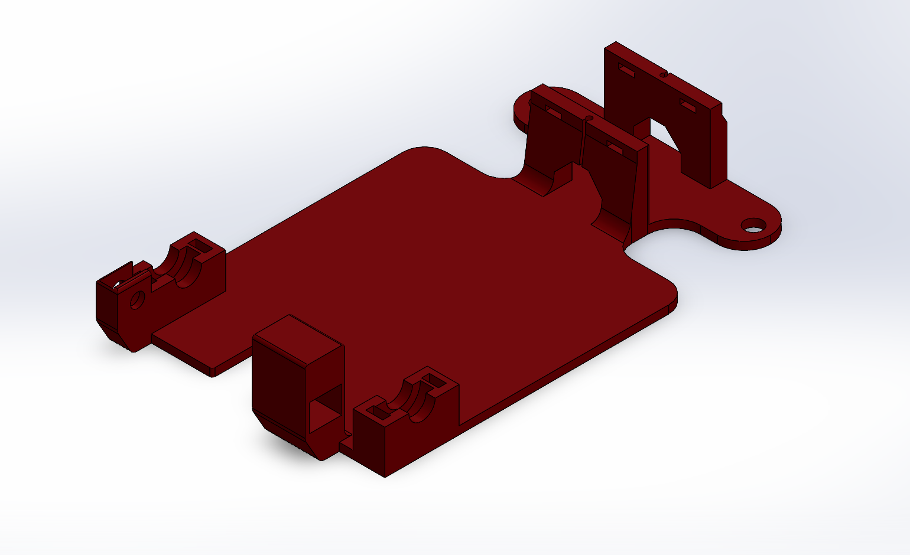</div> |


### 2. Steering System (Ackermann Geometry)
To ensure smooth cornering and minimize tire scrubbing, we implemented an **Ackermann steering mechanism** which is the same type that comercial cars use.
* Actuated by the **MG90 Micro Servo** and a steering system assembled with 3 M2 screws ensure that our ackermann the type steering can work efficiently at all times.
* This geometry is critical for maintaining traction and speed while navigating the tight turns of the challenge in general.

| Our Steering | Ackermann Steering Formula |
|:---:|:---:|
| <div align="center">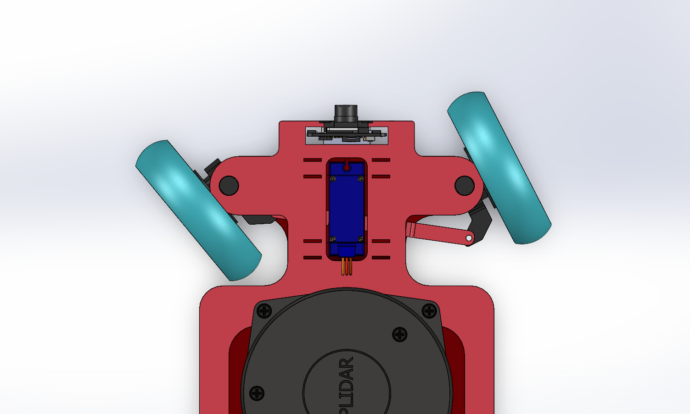</div> | <div align="center">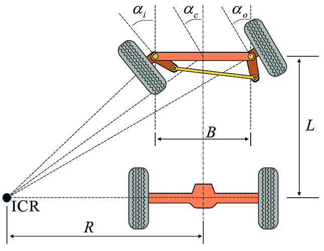</div> |


### 3. Drivetrain & Transmission
* **Rear-Wheel Drive (RWD):** Driven by a single **Pololu 300 RPM DC Motor**. While it was not the fist motor we used, the different design itterations helped us find the perfect motor to power out robot. 
* **Power Transfer:** We designed a custom structure with bearings in order to use the lego differential (pieces 65413 and 65414) connecting the motor to the solid rear axle. This gear ratio was calculated to provide the perfect balance between top speed on the straightaways and high torque for the Obstacle Challenge maneuvers (like parallel parking). We opted for a lego build design due to the risks that a 3D printed one would give us.

### 4. Sensor Integration
* **RPLiDAR Tower:** Elevated and centrally mounted to guarantee a 360° unobstructed field of view, preventing any chassis parts from creating blind spots. It is mounted with M2.5 screws with perfectly designed holes in the cassis.
* **Camera Mount:** The ESP32-CAM is mounted in front of the robot with a simple slot on the cassis so that it can be taken out easily but without compromising stability.

### 🔄 Design Iterations

| Version | Focus Area | Key Improvements |
|---------|------------|------------------|
| **V1.0** | Functionality and weight reduce | Since we used to depend on a RPI and a PWR BANK, the chassis needed to be light and sturdy in order hold up with the weight of this components. |
| **V2.0** | Steering Optimization | Implemented Ackermann geometry, with a MG90 servo in order to provide more torque for our robot. |
| **V3.0** | Final Frame | We changed to lighter components (XIAO C6 and LiPo battery) so our final chassis ended up being more sturdy and easy to assemble then at the beggining. |

## ⚡ Electrical System
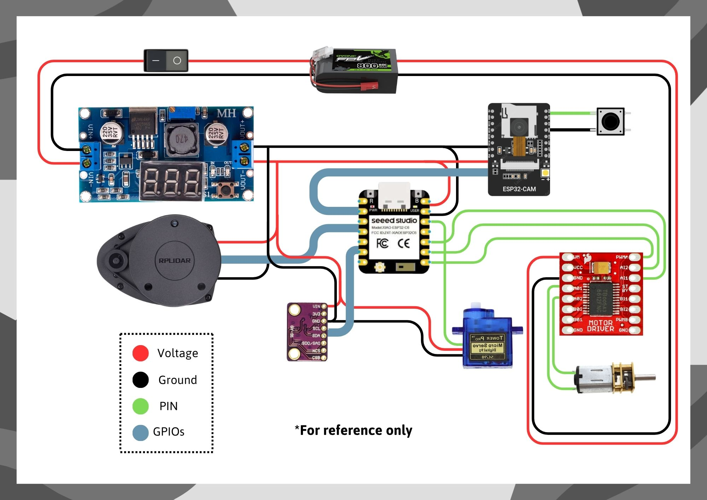

### Power Architecture

```
LiPo Battery 7.4V
       │
   [Switch]
       │
   ┌───┴──────────────────┐
   │                      │
   ▼                      ▼
TB6612FNG              LM2596
Motor Driver          Step-down
  (7.4V)               5V out
   │                      │
   ▼               ┌──────┼──────────┐
Pololu Motor        ▼      ▼          ▼
               ESP32-C6  RPLiDAR  ESP32-CAM
```
---
### Wiring Diagram


---

## 🛠️ Components

| Photo | Component | Description |
|:-----------:|-----------|-------------|
| <div align="center">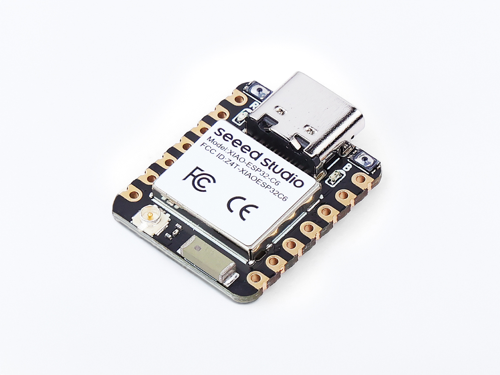</div> | **XIAO ESP32-C6** | • Main microcontroller of the robot <br> • Processes RPLiDAR distance data <br> • Controls steering servo and motor driver <br> • Communicates with ESP32-CAM via UART <br> • Runs navigation and PID control logic |
| <div align="center">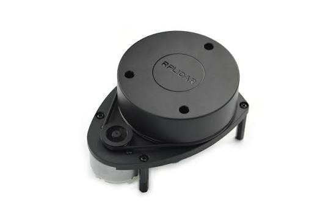</div> | **RPLiDAR A1M8** | • 360° laser distance scanner <br> • Primary perception sensor for wall following <br> • Detects corners, open spaces and obstacles <br> • Connected to ESP32-C6 via UART (TX/RX) <br> • Powered at 5V from LM2596 |
| <div align="center">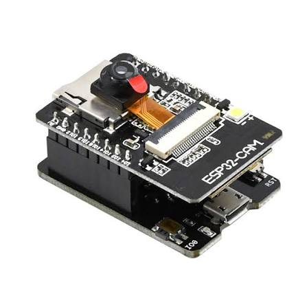</div> | **ESP32-CAM** | • Handles visual color detection <br> • Identifies red and green traffic sign pillars <br> • Sends color decisions to ESP32-C6 via UART <br> • Used exclusively during the Obstacle Challenge |
| <div align="center">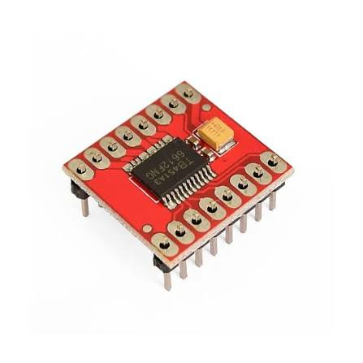</div> | **TB6612FNG Motor Driver** | • Controls Pololu DC motor speed and direction <br> • Accepts PWM + direction signals from ESP32-C6 <br> • Powered directly from LiPo at 7.4V <br> • Protects ESP32 from motor current draw |
| <div align="center">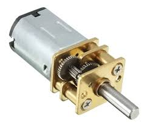</div> | **Pololu DC Motor 300 RPM** | • Rear-wheel drive traction motor <br> • Connected to rear axle through physical gear system <br> • Speed controlled via PWM through TB6612FNG <br> • Single motor drives both rear wheels |
| <div align="center">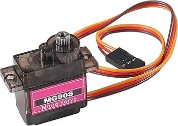</div> | **MG90 Micro Servo** | • Controls front steering mechanism <br> • Physical range: 40° (full left) to 140° (full right) <br> • Center position at 90° = straight ahead <br> • PWM signal from ESP32-C6 GPIO 0 |
| <div align="center">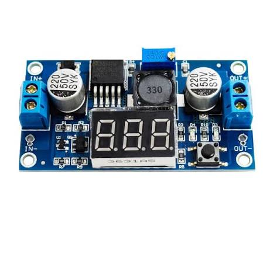</div> | **LM2596 Step-Down Regulator** | • Converts 7.4V LiPo down to stable 5V <br> • Powers all logic components safely <br> • Prevents voltage damage to ESP32 and LiDAR <br> • Adjustable output verified before use |
| <div align="center">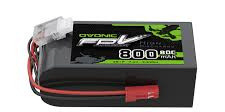</div> | **LiPo Battery 7.4V 800mAh** | • Main power source for the entire system <br> • Directly feeds motor driver at full voltage <br> • Feeds LM2596 for 5V logic rail <br> • Lightweight for weight-sensitive robot design |
| <div align="center">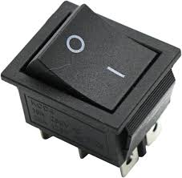</div> | **Power Switch** | • Master on/off switch for the entire system <br> • Required by WRO rules (one switch to power on) <br> • Cuts all power from battery before start |
| <div align="center">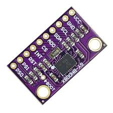</div> | **IMU Sensor** | • Inertial measurement unit <br> • Provides heading and orientation data <br> • Supports navigation during turns <br> • Connected via I2C (SDA/SCL) to ESP32-C6 |

---

### Pin Connections

| Component | ESP32-C6 Pin | Function |
|-----------|-------------|----------|
| LiDAR RX | GPIO 19 | Data reception from LiDAR |
| LiDAR TX | GPIO 16 | Data transmission to LiDAR |
| Servo MG90 | GPIO 0 | Steering PWM signal |
| PWMA | GPIO 22 | Motor speed (PWM) |
| AIN1 | GPIO 2 | Motor direction A |
| AIN2 | GPIO 23 | Motor direction B |
| ESP32-CAM | GPIO (UART) | Color detection data |
| IMU SDA | GPIO 6 | I2C data |
| IMU SCL | GPIO 7 | I2C clock |

---

## 💻 Source Code

The main program runs on the **XIAO ESP32-C6**, which receives RPLiDAR distance data, processes it for navigation decisions, and controls both the steering servo and drive motor.

### What the system does

- Reads 360° distance data from the RPLiDAR A1M8
- Controls drive motor speed via TB6612FNG motor driver
- Controls MG90 steering servo for directional adjustments
- Detects corners and executes turns automatically
- Maintains target distance from track walls
- Applies PID correction to stay centered between walls
- Counts completed laps and stops after 3
- Receives red/green pillar color data from ESP32-CAM (Obstacle Challenge)

### Open Challenge — How it works

The robot uses the RPLiDAR as its only sensor. On each scan cycle it measures distances to the left wall, right wall, and front wall. A proportional controller calculates the steering correction needed to stay centered. When a front wall is detected below the threshold distance, the robot executes a corner turn in the pre-determined direction and increments the corner counter. After 12 corners (3 laps × 4 corners), the robot stops autonomously in the finish section.

### Obstacle Challenge — How it works

Same wall-following base as the Open Challenge, with the addition of the ESP32-CAM. Before passing each traffic sign pillar, the camera classifies its color. A red pillar must be passed on the right; a green pillar must be passed on the left. After completing 3 laps, the robot locates the magenta parking lot boundaries using the LiDAR and executes a parallel parking maneuver.

---

## 🏁 Challenge Summary

| Feature | Open Challenge | Obstacle Challenge |
|---------|---------------|-------------------|
| Laps | 3 | 3 |
| Traffic signs | ✗ | ✓ Red & Green pillars |
| Parking | ✗ | ✓ Parallel parking |
| Primary sensor | RPLiDAR | RPLiDAR + ESP32-CAM |
| Max points | 30 | 62 |

---

## 🔧 Build & Setup

### 1. 🖨️ Print the chassis
Download the 3D models from the `models/` folder and print the required parts.

### 2. ⚙️ Assemble the robot
Mount the motors, servo, LiDAR, and electronics onto the chassis following the design layout.

### 3. 🔌 Wire the electronics
Follow the wiring diagram at `schemes/Esquema_electronica.jpg` to connect all components.

### 4. 💻 Upload the code
Connect each microcontroller to a computer and flash the corresponding programs:
- `src/main/main.cpp` → flash to XIAO ESP32-C6 using Arduino IDE
- `src/main/navigation.py` → run on host computer or single-board computer

### 5. 🔋 Power on and test
Insert the LiPo battery, flip the power switch, and verify all systems initialize correctly before placing the robot on the track.

---

## 👕 Team Photos

| Team | Paco | Emi | Oliver |
|:---:|:---:|:---:|:---:|
| <div align="center">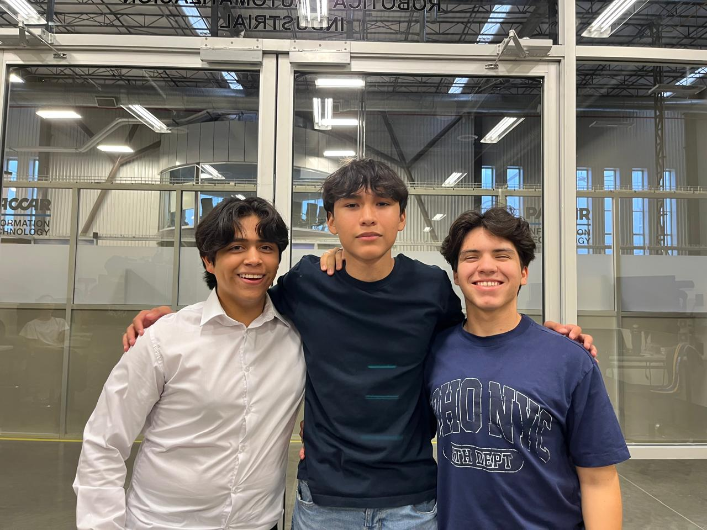</div> | <div align="center">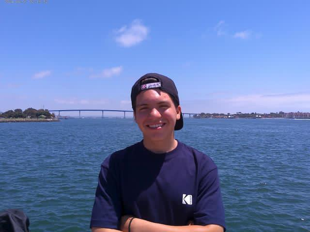</div> | <div align="center">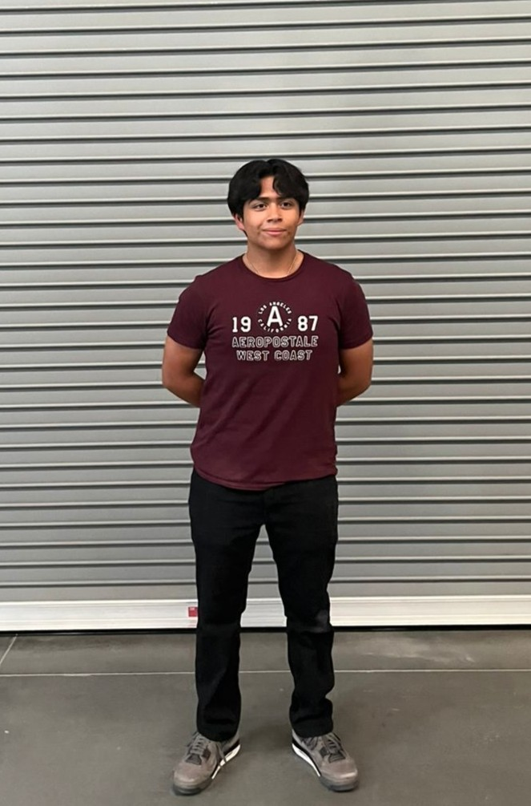</div> | <div align="center">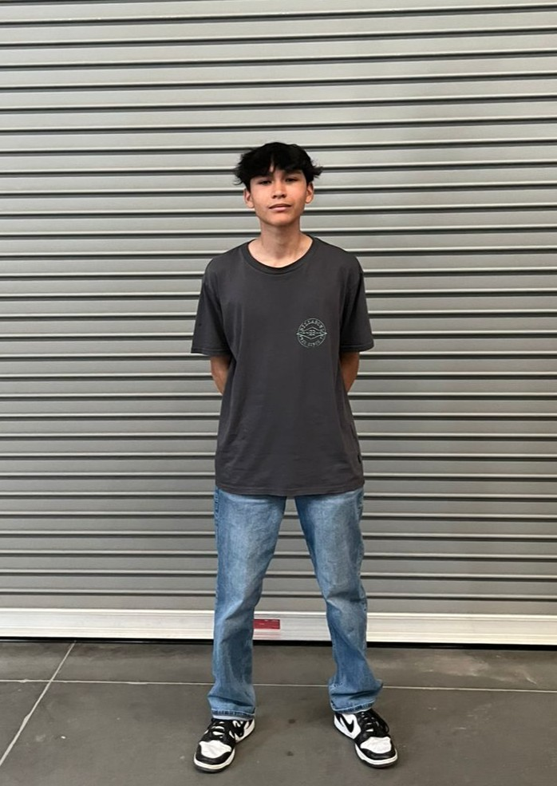</div> |


---

## 🎬 Videos

| Challenge | Link |
|-----------|------|
| Open Challenge — No obstacles | [Watch](video/Video1_SinObs.mp4) |
| Obstacle Challenge | *Coming soon* |
---
- [Go to top](#-Rust-eze)
